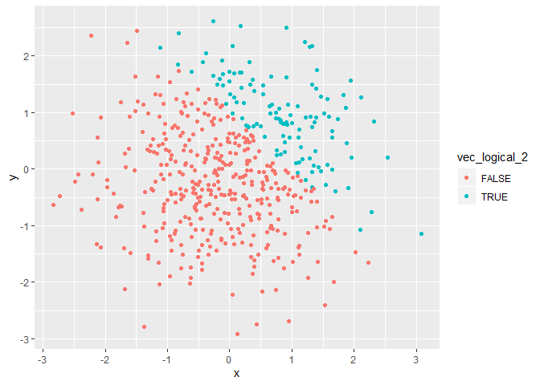

create a single .Rmd file named p8105\_hw1\_jf3286.Rmd
================
Jingyu Fu
2019/9/17

# problem 1

## problem 1.1

``` r
library(tidyverse)

prob1_df = tibble(
  df_sample = rnorm(8),
  vec_logical = df_sample > 0,
  vec_char = c("today","is","monday","and","8","pm","in","hammer"),
  vec_factor = c("1","1","2","2", "3","3","3","3")
)

mean(pull(prob1_df, df_sample))
```

    ## [1] 0.9280043

``` r
mean(pull(prob1_df, vec_logical))
```

    ## [1] 0.75

``` r
mean(pull(prob1_df, vec_char))
```

    ## Warning in mean.default(pull(prob1_df, vec_char)): argument is not numeric
    ## or logical: returning NA

    ## [1] NA

``` r
mean(pull(prob1_df, vec_factor))
```

    ## Warning in mean.default(pull(prob1_df, vec_factor)): argument is not
    ## numeric or logical: returning NA

    ## [1] NA

Taking the mean of df\_sample and vec\_logical work, but taking the mean
of vec\_char and vec\_factor don’t work.

## problem 1.2

``` r
as.numeric(pull(prob1_df, df_sample))
as.numeric(pull(prob1_df, vec_logical))
as.numeric(pull(prob1_df, vec_char))
as.numeric(pull(prob1_df, vec_factor))
```

First of all, converting df\_sample into numeric works becuase it
contains 8 numeric sample and all you need is just to list out all eight
numeric samples. Secondly, converting vec\_char into numeric doesn’t
work because it is not numeric itself, and doesn’t contain any
information that can be related to numbers. Also, vec\_factor is shown
as number 1, 2 and 3 becuase factor contains three levels, and
converting it to numeric means calculating how many levels this factor
contains, and then each factor level stands for a number. Last but
importantly, vec\_logical is shown as 1 and 0 becuase similar to the
converting process of vec\_factor, you need to calculate how many
different logical results there are and each result resembles a bumber.
In this case, logical results contain true and false, and in computer
language 0 refers to false and 1 refers to 1, therefore it is shown as 0
and 1 in correspondence with false and true.

## problem 1.3

``` r
as.numeric(pull(prob1_df, vec_logical))*pull(prob1_df, df_sample)
as.factor(pull(prob1_df, vec_logical))*pull(prob1_df, df_sample)
as.numeric(as.factor(pull(prob1_df, vec_logical)))*pull(prob1_df, df_sample)
```

# problem 2

## proble 2.1

``` r
prob2_df = tibble  (
  x = rnorm (500),
  y = rnorm (500),
  vec_logical_2 = x + y > 1,
  vec_numeric_2 = as.numeric (vec_logical_2 ),
  vec_factor_2 = as.factor (vec_logical_2)
)
```

## problem 2.2

The size of the dataset is 500 rows and 5 columns.

The mean of x is -0.0627943, the median of x is -0.074768, and the
standrd deviation of x is 0.9932839.

The proportion of case for which x + y \> 1 is
0.224.

## problem 2.3

``` r
ggplot (prob2_df, aes(x = x, y = y, color= vec_logical_2) ) + geom_point()
```

<!-- -->

``` r
ggsave("scatter_plot.pdf", height = 6, width = 6)
ggplot (prob2_df, aes(x = x, y = y, color= vec_numeric_2) ) + geom_point()
```

<!-- -->

``` r
ggplot (prob2_df, aes(x = x, y = y, color= vec_factor_2) ) + geom_point()
```

<!-- -->

Three scattere plots have similar color scales. All of them range from
-1 to 3 on x asix and range from -1 2.5 to on y axis.
